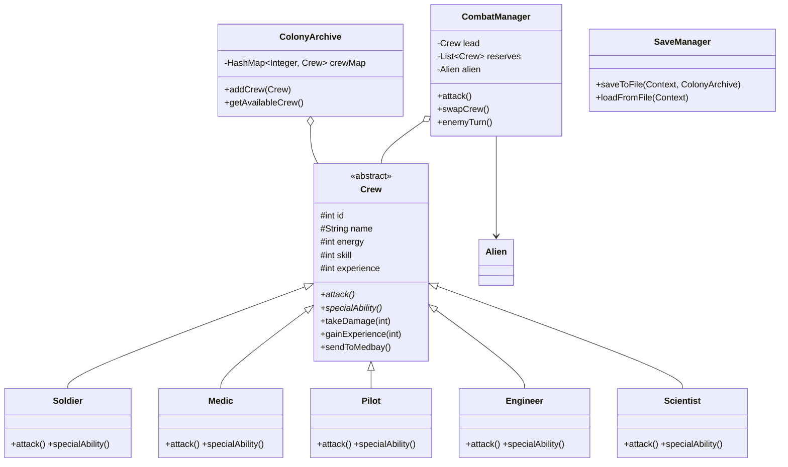

# SpaceColony - OOP Project Work

SpaceColony is an Android-based space colony management game developed for the **CT60A2450 Object-Oriented Programming** course. The project combines tactical turn-based combat with strategic party management, emphasizing OOP principles such as inheritance, polymorphism, and encapsulation.

## Project Description

In SpaceColony, players manage a roster of crew members across five specializations. The goal is to recruit, train, and deploy teams on cooperative missions to neutralize system-generated threats. The game features a persistent world where crew members gain experience, suffer injuries (requiring Medbay recovery), and contribute to the long-term statistics of the colony.

---

## Team Composition

- **Zuhayr**: Lead Developer (Individual Project)
  - Responsibilities: System architecture, core game logic, UI/UX design, data persistence, and documentation.

---

## Implemented Features

### 1. Mandatory Features (Base Requirements)
- **Crew Management**: Users can recruit five types of crew members (Pilot, Engineer, Medic, Scientist, Soldier). Newly recruited members are placed in **Quarters**.
- **Training System**: A **Simulator** where crew members gain Experience Points (XP). Every 100 XP increases the crew member's **Skill** power by 1 point.
- **Cooperative Mission System**:
  - Users select a lead crew and reserves for missions.
  - System-generated **Threats** (Aliens) scale in difficulty based on progress.
  - Turn-based combat where crew and threats take turns acting.
  - Victory awards XP; defeat leads to removal or recovery.
- **Crew Recovery**: Returning to Quarters fully restores a crew member's energy while retaining their XP.
- **Object-Oriented Design**: Implementation follows strict OOP paradigms with clear separation between models (Crew subclasses), logic (CombatManager, SaveManager), and UI (Activities/Fragments).
- **Data Structures**: Effective use of `HashMap<Integer, Crew>` for efficient indexing and `ArrayList` for dynamic list management in UI components.

### 2. Bonus Features (Extra Points)
- **RecyclerView Implementation**: Used to display dynamic lists of crew members in the Quarters and Medbay.
- **Specialized Crew Visuals**: Each specialization and gender has unique image assets.
- **Tactical Combat**: A complex turn-based system allowing the player to **Attack**, **Defend**, use **Special Abilities**, or **Swap** between Lead and Reserve crew members.
- **No-Permanent-Death (Medbay)**: Instead of being deleted, fallen crew members are sent to the **Medbay** for recovery, adding a management layer.
- **Specialization Bonuses**: Implemented polymorphism where different classes receive bonuses based on the **Mission Type** (e.g., Soldiers in Combat, Scientists in Research).
- **Larger Squads**: Support for 3-person squads (1 Lead + 2 Reserves), increasing tactical depth.
- **Fragment Usage**: Meaningful use of `RosterFragment` and `MedbayFragment` to handle different views within the main hub.
- **Persistent Data Storage**: Supports both automatic saves via `SharedPreferences` and manual JSON file Export/Import for backup.
- **Statistics & Visualization**: Tracks mission wins, losses, and training sessions. Visualizes progress using **AnyChart** pie charts.
- **Combat Randomness**: Included variance in damage calculation (`Math.random()`) to make combat unpredictable.

---

## Application Use-Flow

1. **Main Hub (MainActivity)**: The player starts at the colony overview, seeing current crew distribution.
2. **Recruitment**: The player visits the **Recruit Screen** to add new members with custom names and chosen classes.
3. **Training**: Crew members are moved to the **Simulator** to spend time training and increasing their combat Skill.
4. **Mission Preparation**: In **SelectDuoActivity**, the player forms a squad (Lead + Reserves) and selects a **Mission Type** to optimize for bonuses.
5. **Combat**: The battle takes place in **MissionControlActivity**. The player manages resources (Energy/Medkits) and swaps crew to survive.
6. **Aftermath**: Successful crew gain XP. Defeated crew are moved to the **Medbay** and are temporarily unavailable.
7. **Statistics**: Players can review the colony's overall success rate and individual crew achievements in the **Statistics Activity**.

---

## Design and Architecture

### Class Diagram (Models & Logic)
The core architecture follows a hierarchy where specific crew classes inherit from a base abstract `Crew` class, overriding behavior for combat and special abilities.

---

## Tools Used

- **Android Studio**: Primary development environment.
- **Java**: Core programming language.
- **Gradle**: Dependency management and build automation.
- **Gson**: Library for handling JSON serialization for data persistence.
- **AnyChart-Android**: For generating statistics pie charts.

---

## AI Usage Disclaimer

AI tools (Large Language Models) were utilized during the development of this project for the following purposes:
- Assisting in the generation of standard Android Activity templates and XML layouts.
- Debugging complex logic within the `CombatManager` death-checking routines.
- Formatting and refining the project documentation.

---

## Links

- **GitHub Repository**: [Insert Link Here]
- **Project Video Description**: [Insert Link Here]
