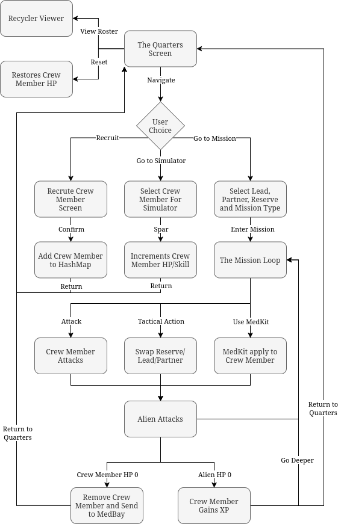
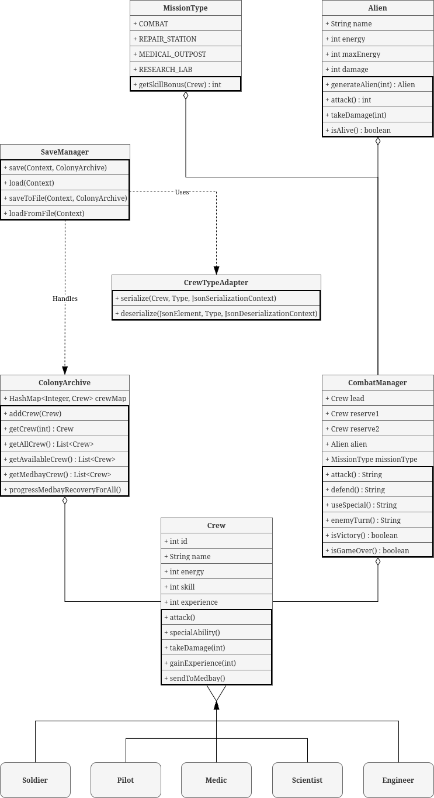

# Space Colony - Project Work Plan

---

## Table of Contents

1. [Project Introduction](#project-introduction)
2. [Mandatory Features (Base Requirements)](#mandatory-features-base-requirements)
3. [Bonus Features (Extra Points)](#bonus-features-extra-points)
4. [Tools Used](#tools-used)
5. [Core Game Mechanics](#core-game-mechanics)
6. [Application Use-Flow](#application-use-flow)
7. [UML Class Diagram](#uml-class-diagram)

---

## Project Introduction

Space Colony is an Android application designed to simulate the management of a space station's crew. The project fulfills the requirements of the CT60A2450 course by implementing a system where players recruit, train, and deploy crew members on tactical missions. The application emphasizes the core pillars of OOP (inheritance, encapsulation, and polymorphism) to create an experience that meets the project work description.

The main loop centers on risk control. You decide whether to continue for better rewards or return to the Quarters to keep your team alive. The gameplay emphasizes squad planning and resource management over fast action.

---

## Mandatory Features (Base Requirements)

*   **Object-Oriented Design:** Implementation follows strict OOP paradigms with clear separation between models, logic, and UI.
*   **Code Language:** All code, comments, and documentation are in English.
*   **Android App Development:** The application runs Android devices (Android 12+) and is written using Java in Android Studio.
*   **Crew Management:** Users can recruit five types of crew members (Pilot, Engineer, Medic, Scientist, Soldier).
*   **Quarters:** Newly recruited members are placed in Quarters.
*   **Training System:** The Simulator is where crew members gain Experience Points (XP). Every 100 XP increases the crew member's Skill power by 1 point.
*   **Battle Arena:** The Mission Control is where crew members go to face Threats (Aliens) in different mission types.
*   **Cooperative Mission System:** Users select a lead crew and reserves for missions.
*   **Threats:** System-generated Threats (Aliens) scale in difficulty based on progress.
*   **Combat:** Turn-based combat where crew and threats take turns acting.
*   **Victory:** Victory awards XP.
*   **Defeat:** Defeat leads to removal of crew mate from party (Temporarily).
*   **Crew Recovery:** Returning to Quarters fully restores a crew member's energy while retaining their XP.
*   **Data Structures:** Effective use of `HashMap<Integer, Crew>` for efficient indexing and `ArrayList` for dynamic list management in UI components.

---

## Bonus Features (Extra Points)

| Feature | Description | Points |
| :--- | :--- | :--- |
| RecyclerView | Used to display dynamic lists of crew members in the Quarters. | +1 |
| Crew Images | Each specialization and gender has unique image assets. | +1 |
| Mission Visualization | Textual description, images for crew/threats, dynamic HP bar updates, attack visualization. | +2 |
| Tactical Combat | Turn-based system: Attack, Defend, Special Abilities, Swap Lead/Reserve. | +2 |
| Statistics | Tracks mission wins, losses, and training sessions. | +1 |
| No Death | Fallen crew locked and sent to Medbay to recover for 2 missions. | +1 |
| Randomness | Variance in damage calculation (`Math.random()`). | +1 |
| Specialization Bonuses | Polymorphism for bonuses (e.g., Soldiers in Combat). | +2 |
| Larger Squads | Support for 3-person squads (1 Lead + 2 Reserves). | +2 |
| Fragments | `RosterFragment` and `MedbayFragment` to handle views. | +2 |
| Data Storage | Supports manual JSON file Export/Import for backup. | +2 |
| Statistics Visualization | Pie Chart powered by AnyChart library. | +2 |
| Custom Feature X (MedKit) | Earn MedKits to restore HP in battle. | +2 |

---

## Tools Used

*   **Android Studio:** Primary development environment.
*   **Java:** Core programming language.
*   **Gradle:** Dependency management and build automation.
*   **Gson:** Library for handling JSON serialization for data persistence.
*   **AnyChart-Android:** For generating statistics pie charts.

---

## Core Game Mechanics

*   **Colony Overview:** Entry point for viewing crew across Quarters, Simulator, and Mission Control.
*   **Recruitment:** Recruit from five specializations (Pilot, Engineer, Medic, Scientist, Soldier), each with unique stats.
*   **Training:** Simulator sessions award XP; every 100 XP grants a permanent +1 bonus to Skill.
*   **Mission Selection:** Select a 3-person squad and mission type; system generates a scaled Threat.
*   **Tactical Combat:** Turn-based battle (Attack, Defend, Special Ability). Classes receive +2 Skill bonus if their specialization matches the Mission Type.
*   **Recovery & Aftermath:** Defeated crew recover in Medbay for 2 missions.
*   **Statistics:** Review success rate and individual achievements.

---

## Application Use-Flow

---

## UML Class Diagram

### Class Mapping

| Class Name | Responsibility |
| :--- | :--- |
| Crew | Base model for crew members. |
| Soldier / Pilot... | Specialized crew via polymorphism. |
| Alien | System-generated threat. |
| ColonyArchive | Manages crew collection. |
| CombatManager | Orchestrates turn-based combat. |
| MissionType (Enum) | Defines mission categories/bonuses. |
| SaveManager | Data persistence. |
| CrewTypeAdapter | GSON adapter for polymorphism. |
